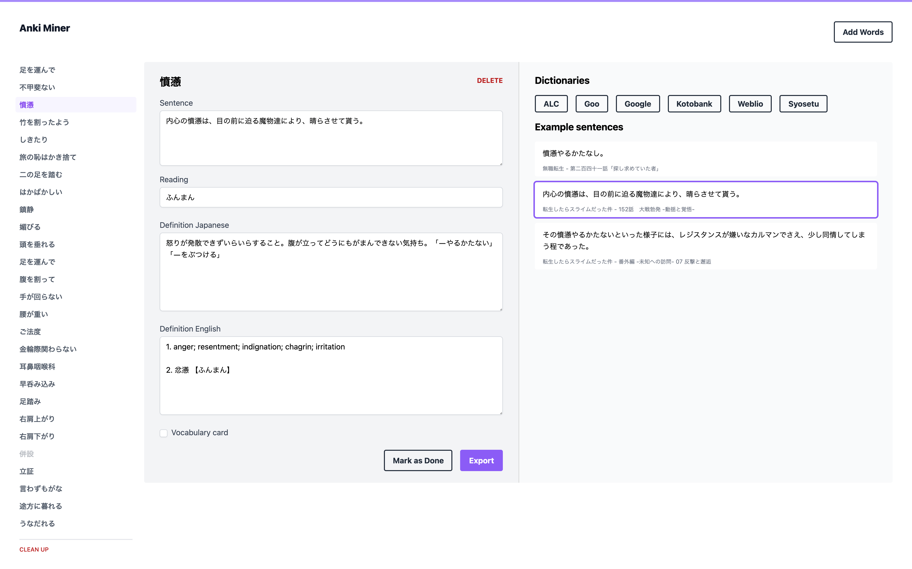

# jp-learning-tools

Tools to help with learning Japanese.

## Disclaimer

This is not meant to be hosted for public users because it fetches data directly from dictionary websites. It's built to create Anki cards for personal usage.

The code is also of prototype quality because it's not meant to be ran in production.

## Tools

### Anki Miner

A frontend for creating Anki cards given a list of words.

#### Setup

1. Install AnkiConnect
2. Add `http://localhost:3000` to AnkiConnect `webCorsOriginList`
3. Make sure the Note type `ankiminer_jp` exists, check `frontend/anki/src/app/api.ts` for the format
4. Update the deck name in `frontend/anki/src/app/api.ts` if using a different deck name
5. Make sure to use `Syosetu scraper` to build a corpus to find example sentences
6. Run the frontend and API
  ```sh
  # Frontend
  cd frontend/anki
  yarn dev

  # API
  go run cmd/api/main.go
  ```

#### Preview



### Syosetu scraper

```sh
go run cmd/scrape_syosetu/main.go --help
Usage of /var/folders/fw/0wq08yqd3fgd69t86wv72l040000gn/T/go-build4010932054/b001/exe/main:
  -end int
        the ending chapter (default 10)
  -series string
        the code of a series (default "n6316bn")
  -start int
        the starting chapter (default 1)
```

#### Example

```sh
# Download the first 50 chapters of Mushoku Tensei
go run cmd/scrape_syosetu/main.go -series n9669bk -end 50
```

### Search for word in corpus

```sh
go run cmd/find_sentence/main.go -word これから
```
